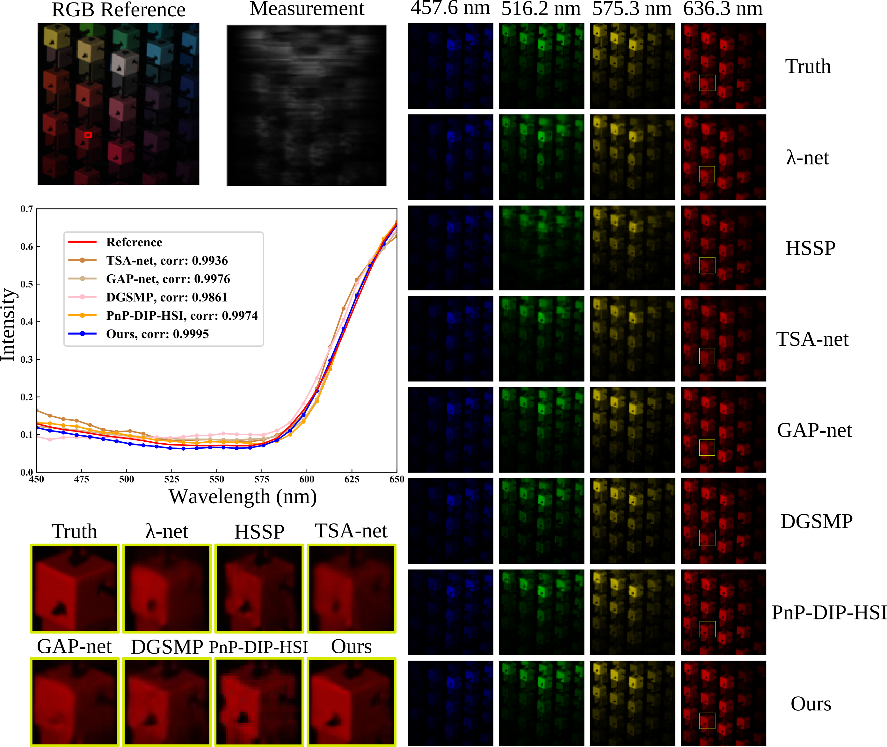
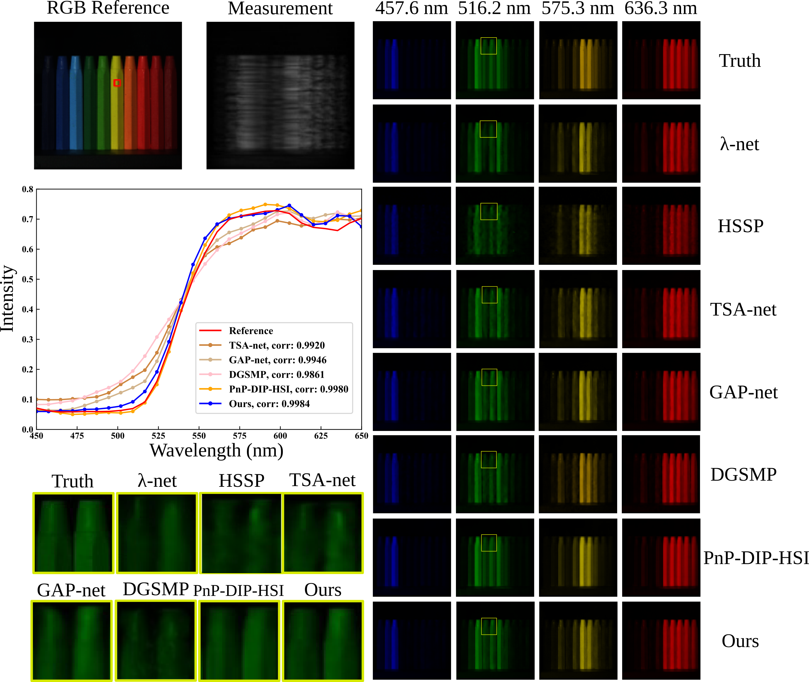

# Spectral Compressive Imaging Reconstruction Using Convolution and Contextual Transformer 
## Abstract
Spectral compressive imaging (SCI) is able to encode the high-dimensional hyperspectral image
into a two-dimensional (2D) snapshot measurement, and then use algorithms to reconstruct
the spatio-spectral data-cube. At present, the main bottleneck of SCI is the reconstruction
algorithm, and state-of-the-art (SOTA) reconstruction methods generally face the problems of
long reconstruction time and/or poor detail recovery. In this paper, we propose a novel hybrid
network module, namely CCoT (Convolution and Contextual Transformer) block, which can
simultaneously acquire the inductive bias ability of convolution and the powerful modeling
ability of Transformer, which is conducive to improving the quality of reconstruction to restore
fine details. We integrate the proposed CCoT block into a physics-driven deep unfolding
framework based on the generalized alternating projection algorithm, and further propose the
GAP-CCoT network. Finally, we apply the GAP-CCoT algorithm to SCI reconstruction. Through
experiments on a large amount of synthetic data and real data, our proposed model achieves
higher reconstruction quality (>2dB in PSNR on simulated benchmark datasets) and shorter
running time than existing SOTA algorithms by a large margin. The code and models are publicly
available at https://github.com/ucaswangls/GAP-CCoT.

## Testing Result on Six Simulation Dataset
<div>
   
</div>

## Environment
* Python 3
* Pytorch 1.9+
* Numpy
* Opencv-python 
* Scikit-image
* Scikit-learn

## Installation
Install the corresponding cupy according to the cuda version, please refer to the [cupy](https://cupy.dev/) official website for details. 
```
git clone https://github.com/ucaswangls/GAP-CCoT.git
```
## Testing  on Simulation Dataset

```
python test.py
```
## Training GAP-CCoT
Support multi GPUs and single GPU training efficiently.  

For the training dataset, please refer to  to download. 
For model training. First, refer to [TSA-net](https://github.com/mengziyi64/TSA-Net) to download the training dataset, and then modify the --train_data_path value in the opt.py file to point to the training dataset path.

Launch multi GPU training by the statement below:
```
CUDA_VISIBLE_DEVICES=0,1,2,3 python -m torch.distributed.launch --nproc_per_node=4  --master_port=3278 train.py --distributed=True
```
* CUDA_VISIBLE_DEVICE: specify number of GPUs
* --nproc_per_node: number of used GPUs
* --master_port: main node port number, usually for communication

Launch single GPU training by the statement below.

Default using GPU 0. One can also choosing GPUs by specify CUDA_VISIBLE_DEVICES

```
python tools/train.py 
```

```
@article{wang2022snapshot,
  title={Snapshot spectral compressive imaging reconstruction using convolution and contextual Transformer},
  author={Wang, Lishun and Wu, Zongliang and Zhong, Yong and Yuan, Xin},
  journal={Photonics Research},
  volume={10},
  number={8},
  pages={1848--1858},
  year={2022},
  publisher={Optica Publishing Group}
}
```